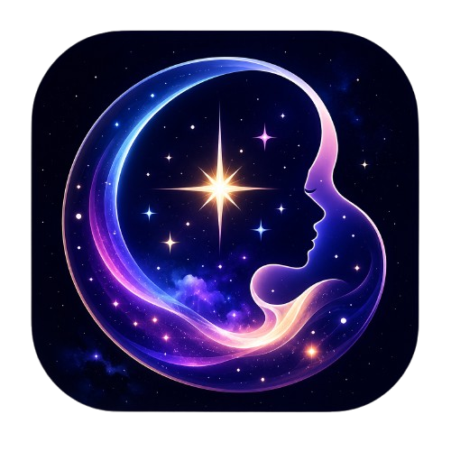

<h1 align="center">✦ SoulVerse</h1>

<p align="center">
  <strong>Where every feeling becomes a star</strong>
</p>

<p align="center">
  <em>An interactive 3D emotion galaxy — a space to share, explore, and connect through feelings.</em>
</p>

<p align="center">
  
</p>

---

## ✦ Overview

**SoulVerse** is a browser-based 3D web application that transforms human emotions into a living, breathing galaxy of stars. Users write a message about how they're feeling, choose an emotion category, and their message becomes a glowing star in a procedurally generated spiral galaxy. Other users can explore the galaxy, click on stars to read messages, leave comments, and send "light" (likes).

Every emotion — whether happy, sad, anxious, or grateful — adds to the collective beauty of the universe.

---

## ✨ Features

### 🌌 Interactive 3D Galaxy
- Procedurally generated spiral galaxy built with **Three.js**
- Glowing, pulsing stars with custom bloom post-processing effects
- User-owned stars shine brighter with enhanced glow and larger size
- Orbit controls to pan, zoom, and rotate around the galaxy
- Smooth camera animations when clicking or exploring stars

### 💬 Emotion-Powered Stars
- **11 emotion categories:** Happy, Sad, Angry, Anxious, Excited, Grateful, Hopeful, Lonely, Love, Peaceful, and General
- Each emotion has a unique color mapped to its star
- Stars float and pulse with a "breathing" animation
- Each star displays: message text, author name, emotion type, timestamp, likes, and comments

### 🔍 Search & Filter
- **Search bar** to find stars by text or author name
- **Emotion filter pills** to view stars by a specific emotion
- **"My Stars" filter** to view only your own stars
- Real-time star counter showing visible vs total stars

### 💡 Comments & Likes
- Click any star to open a glassmorphism modal with full details
- Leave comments/messages on any star
- Send "light" (likes) to stars you appreciate
- Real-time comment updates via Supabase subscriptions

### 🎲 Explore Mode
- Auto-pilot mode that randomly navigates through stars
- Each star is displayed for a few seconds before moving to the next
- Click anywhere or press Stop to exit explore mode

### 🎵 Immersive Audio
- Background ambient music (2 tracks included)
- Chime sound when a new star is created
- Soft chime when comments are left on stars
- Toggle sound on/off via HUD button

### ⭐ My Stars Management
- View all your created stars in a dedicated panel
- **Edit** star messages inline
- **Delete** stars with a custom confirmation modal (no native `confirm()` dialogs)
- Click a star in the panel to fly directly to it in the galaxy

### 📱 Responsive Design
- Fully responsive for desktop, tablet, and mobile
- Mobile-optimized HUD with icon-only buttons on very small screens
- Touch-friendly interactions with tap vs drag detection
- Bottom-sheet style modal on mobile

### 🔄 Real-Time Updates
- New stars from other users appear in real time
- Comments appear live without page refresh
- Polling fallback every 10 seconds for new stars
- Toast notifications for new stars and comments

---

## 🛠 Tech Stack

| Technology | Purpose |
|---|---|
| **HTML5 / CSS3** | Structure and styling |
| **JavaScript (ES Modules)** | Application logic |
| **Three.js** (r160) | 3D galaxy rendering |
| **Supabase** | Backend database, RLS, real-time subscriptions |
| **PostgreSQL** | Database (stars, comments, user_stats tables) |
| **Web Audio API** | Sound effects and background music |
| **CSS Glassmorphism** | UI design pattern for modals and panels |

---

## 📂 Project Structure

```
SoulVerse/
├── index.html                  # Main application entry point
├── support-dev.html            # Support the developer page
├── README.md                   # Project documentation
├── TODO.md                     # Developer task tracking
├── PLAN.md                     # Implementation plan reference
│
├── assets/
│   ├── SoulVerse.png           # Application logo / favicon
│   ├── gcash-qr.jpg            # GCash QR code for donations
│   └── desktop.ini             # Windows directory metadata
│
├── css/
│   ├── style.css               # Main application styles
│   └── support-dev.css         # Support page styles
│
├── js/
│   └── script.js               # Main application JavaScript (Three.js + Supabase)
│
├── sound/
│   ├── sv-sound.mp3            # Background music track 1
│   └── sv2-sound.mp3           # Background music track 2
│
└── sql-schema/
    └── SoulVerse Database Schema v1.0.txt   # Full Supabase/PostgreSQL schema
```

---

## 🚀 Getting Started

### Prerequisites
- A modern web browser (Chrome, Firefox, Edge, Safari)
- No build tools or server required — the app runs entirely in the browser via ES modules and CDN imports.

### Running Locally
1. **Clone or download** this repository to your machine.
2. **Open `index.html`** in your browser.
   - You can simply double-click the file or serve it with any static server:
     ```bash
     # Using Python (if installed)
     python -m http.server 8080
     
     # Using Node.js (if installed)
     npx serve .
     ```
3. **Share your emotion** — type a message, select an emotion, and click "Release into the Universe."
4. **Explore the galaxy** — click on stars to read messages, leave comments, and send light.

> **Note:** The app connects to a live Supabase instance. All stars and comments are persisted and shared globally.

---

## 🗄 Database Schema

SoulVerse uses **Supabase** (PostgreSQL) with the following tables:

### `stars`
| Column | Type | Description |
|---|---|---|
| `id` | UUID (PK) | Unique star identifier |
| `user_id` | TEXT | Anonymous session identifier |
| `text` | TEXT | The emotion message |
| `name` | VARCHAR(100) | Display name (default: "Anonymous") |
| `emotion` | VARCHAR(50) | Emotion category |
| `likes` | INTEGER | Number of likes received |
| `liked_by` | TEXT[] | Array of user IDs who liked |
| `created_at` | TIMESTAMPTZ | When the star was created |
| `updated_at` | TIMESTAMPTZ | Last update timestamp |

### `comments`
| Column | Type | Description |
|---|---|---|
| `id` | UUID (PK) | Unique comment identifier |
| `star_id` | UUID (FK → stars) | Associated star |
| `user_id` | TEXT | Commenter's session ID |
| `text` | TEXT | Comment content |
| `name` | VARCHAR(100) | Display name |
| `is_mine` | BOOLEAN | Flag for user's own comments |
| `created_at` | TIMESTAMPTZ | When the comment was created |

### `user_stats`
| Column | Type | Description |
|---|---|---|
| `user_id` | TEXT (PK) | User session identifier |
| `total_stars` | INTEGER | Total stars created |
| `total_likes_received` | INTEGER | Total likes across all stars |
| `total_comments_made` | INTEGER | Total comments made |
| `created_at` | TIMESTAMPTZ | Account creation time |
| `updated_at` | TIMESTAMPTZ | Last update timestamp |

**Row Level Security (RLS)** is enabled on all tables with policies that allow public read, public insert, and user-scoped update/delete.

---

## 🎨 Emotion Colors

| Emotion | Color | Hex |
|---|---|---|
| Happy | Gold | `#FFD700` |
| Sad | Slate Blue | `#6A5ACD` |
| Angry | Orange Red | `#FF4500` |
| Anxious | Dark Turquoise | `#00CED1` |
| Excited | Hot Pink | `#FF69B4` |
| Grateful | Lime Green | `#32CD32` |
| Hopeful | Orange | `#FFA500` |
| Lonely | Silver | `#C0C0C0` |
| Love | Deep Pink | `#FF1493` |
| Peaceful | Sky Blue | `#87CEEB` |
| General | Soft Purple | `#A78BFA` |

---

## 🎮 Controls

| Action | Desktop | Mobile |
|---|---|---|
| Rotate galaxy | Click & drag | Touch & drag |
| Zoom | Scroll | Pinch |
| Select a star | Click | Tap |
| Close modal | Click ✕ / Press Escape | Tap ✕ |
| Explore mode | Click "Explore" button | Tap "Explore" button |
| Toggle sound | Click sound button | Tap sound button |
| Manage my stars | Click "Manage" button | Tap "Manage" button |
| Refresh galaxy | Click "Refresh" button | Tap "Refresh" button |
| Go back to landing | Click "Back" button | Tap "Back" button |

---

## 🤝 Support the Developer

SoulVerse is a passion project built with love. If you'd like to support the developer behind the stars, you can donate via GCash:

- Visit the **[Support Page](support-dev.html)** from the landing screen
- Scan the GCash QR code with your mobile app
- Every contribution helps keep the galaxy growing ✦

---

## 📄 License

This project is open source and available for personal and educational use.

---

## 🙏 Acknowledgments

- Built with [Three.js](https://threejs.org/) — the 3D library powering the galaxy
- Backend by [Supabase](https://supabase.com/) — open-source Firebase alternative
- Sound effects generated with the Web Audio API
- Inspired by the idea that every feeling matters and deserves to shine

---

<p align="center">
  <strong>✦ Share your light. Shine in the SoulVerse. ✦</strong>
</p>

